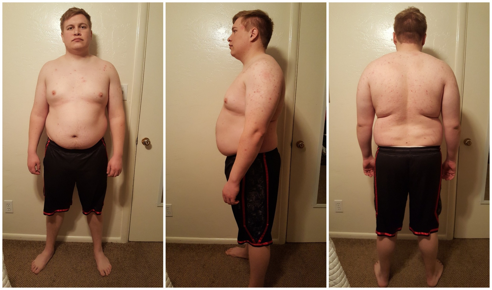

*If you haven't yet read my [About](/about) page be sure to check it out. It'll help you know who I am, what plan I am following, and what the 20 Weeks to Fit challenge is all about.*

### A Wake Up Call
As I have been getting ready to start the first week of my 20 week challenge something interesting and difficult happened yesterday. My wife and I stopped by T.J. Maxx to pick up some new shirts for summer. I grabbed all of the XL sized shirts that I wanted to try on and we went to the dressing room. I tried on 10 different shirts and **every single one** was too tight. I can't wear XL anymore! It was really disheartening but upon reflection it does not come as a surprise. I've noticed over the last year that less and less of my wardrobe actually fits. I only have a few shirts and sweaters that still fit around my mid-section. It was a real wake up call that I couldn't buy a single XL because up to this point I've always bought XL. I still remember when I first started gaining weight and XL shirts were my "baggy" shirts.

I decided not to opt for XXL, and instead didn't buy any shirts. This was in part a matter of pride but the also because I am not going to let myself live this way anymore. I still have time before summer comes and when it starts getting warm I want to be able to wear XL shirts again. I may not even have to buy shirts once I start losing weight because much of my current wardrobe will begin fitting again.

### More Wake Up Calls
I have had other wake up calls over the last few weeks. 

My wife and I went to a chocolate tasting event with my company. Later someone posted a picture they took and I saw a candid moment of myself with my wife.

And the first thing I noticed was that I have ballooned up! I am so much larger in this picture than I am in my mind's eye. It was honestly shocking to see. I rarely see pictures of myself and so seeing this gave me an honest evaluation of how large I have been getting.

Aside from this I have also noticed
* My **double chin** has become ever-present, not just when my head is tilted down
* I have **heartburn** nearly every single night
* My wife doesn't fit as well in my arms and I can't sleep on my stomach anymore because **my gut gets in the way**

And then of course there are my other medical problems I am facing that you can read about in my [About](/about) page.

### The Commitment
How am I going to fix this? As you probably know by now, I am committing to 20 weeks of building a solid healthy lifestyle. My commitment is to change my life in a lasting way and overcome obesity. The wake up calls I have had have only solidified my resolve. I can't afford to wait another day to get fit. Today marks the start of that challenge and the start of my first week. I will be updating this blog weekly to report on my progress and to share with you what I have learned along the way. So let's begin.

### My Focus For This Week
1. Don't miss a single workout or cardio session
2. Stay within my 1800 calorie goal (I'm not worried about getting the right macro-nutrient balance this week)
3. Stick to my schedule and get 8 hours of sleep

### Starting Measurements

| **Weight** | 255 lbs |
| **Waist** | 48 inches |
| **Belt** | 43 inches |

