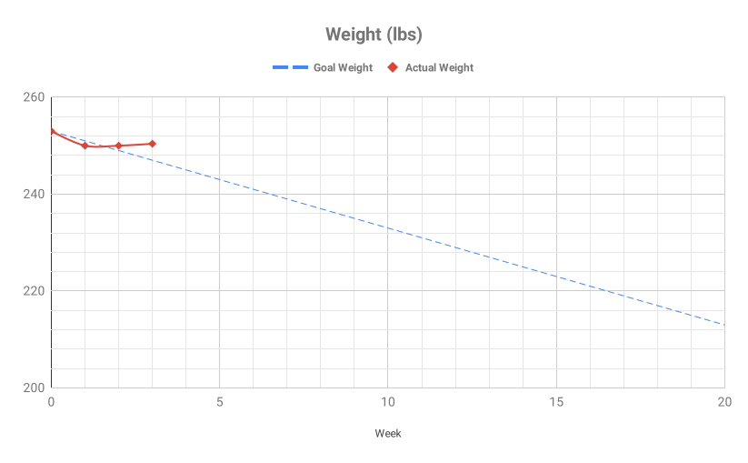

## Weight

---
## Measurements

---
## Strength

<!-- ---
## Consistency

| Week | Diet | Lifting | Cardio |
| :-------------: | :-------------: | :-------------: | :-------------: |
| 1 | x | x | - |
| 2 |  |  |  |
| 3 |  |  |  |
| 4 |  |  |  |
| 5 |  |  |  |
| 6 |  |  |  |
| 7 |  |  |  |
| 8 |  |  |  |
| 9 |  |  |  |
| 10 |  |  |  |
| 11 |  |  |  |
| 12 |  |  |  |
| 13 |  |  |  |
| 14 |  |  |  |
| 15 |  |  |  |
| 16 |  |  |  |
| 17 |  |  |  |
| 18 |  |  |  |
| 19 |  |  |  |
| 20 |  |  |  | -->
